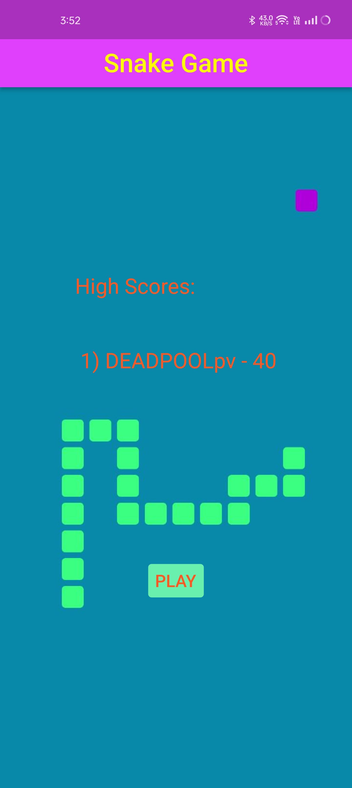
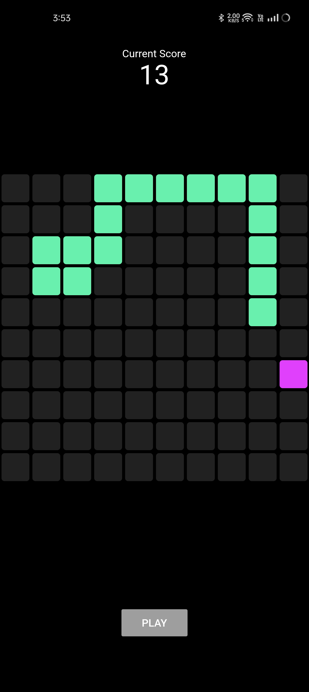

# Flutter Snake Game

<table>
  <tr>
    <td></td>
    <td></td>
  </tr>
</table>

This Flutter code simulates the traditional Snake game, in which players use touch gestures to guide a snake around a grid and devour food. When the snake collides with itself or the borders, the game calculates the score and shows an alert dialogue.

## Key features:

- Visuals: The game uses a grid layout with custom widgets (BlackPixel, SnakePixel, and FoodPixel) to represent the game board, snake body, and food.
- Players may control the snake's direction by swiping their fingertips vertically or horizontally over the game grid.
- Snake Movement: After a specified interval, the snake's position is updated depending on its current direction. It wraps around the grid's boundaries.
- Food is represented by a pixel and is randomly distributed over the grid. When the snake consumes the food, its score rises, and the food returns in a different spot.
- Game Over: The game finishes when the snake collides with itself or the grid's edges. The final score is displayed via an alert dialogue.
- Start/Stop: A "PLAY" button enables players to begin the game and is disabled while the game is underway (greyed out).
- Responsiveness: The grid size and snake movement adjust to various screen sizes.
- Dart code: The code is written in Dart, a programming language ideal for Flutter development.
